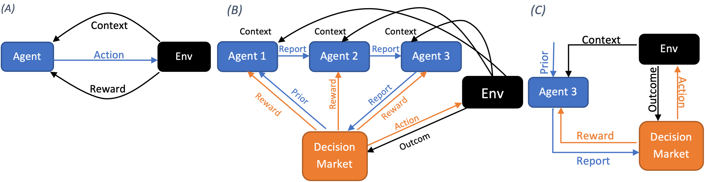

# Decision Market Based Multi-agent Contextual Bandit System
#### This is a project for the paper ***"Decision Market Based Learning For Multi-agent Contextual Bandit Problems"*** https://arxiv.org/abs/2212.00271
> Abstract: Information is often stored in a distributed and proprietary form, and agents who own information are often self-interested and require incentives to reveal their information. Suitable mechanisms are required to elicit and aggregate such distributed information for decision making. In this paper, we use simulations to investigate the use of decision markets as mechanism in a multi-agent learning system to aggregate distributed information for decision-making in a contextual bandit problem. The system utilises strictly proper decision scoring rules to assess the accuracy of probabilistic reports from agents, which allows agents to learn to jointly solve the contextual bandit problem. Our simulations show that our multi-agent system with distributed information can be trained as efficiently as a centralised counterpart with a single agent that receives all information. Moreover, we use our system to investigate the scenarios with deterministic decision scoring rules which are not incentive compatible. We observe the emergence of a more complex dynamics with manipulative behaviour, which agrees with existing theoretical analyses.

This project is a multi-agent bandit learning system that aims to solve a contextual bandit problem with a group of self-interested agents. The programme simulates a decision-maker selecting among a set of alternative actions by enquiring about multi-sourced data holders without accessing the private and local data.

<figure>

<figcaption align = "center"><b>Fig 1: Decision markets based multi-agent system. (A) a regular contextual bandit system. (B)Multi-agent contextual bandit system with a decision market (this project). (C) a contextual bandit system with a continuum-arm space in agent 3's perspective. </b></figcaption>
</figure>
